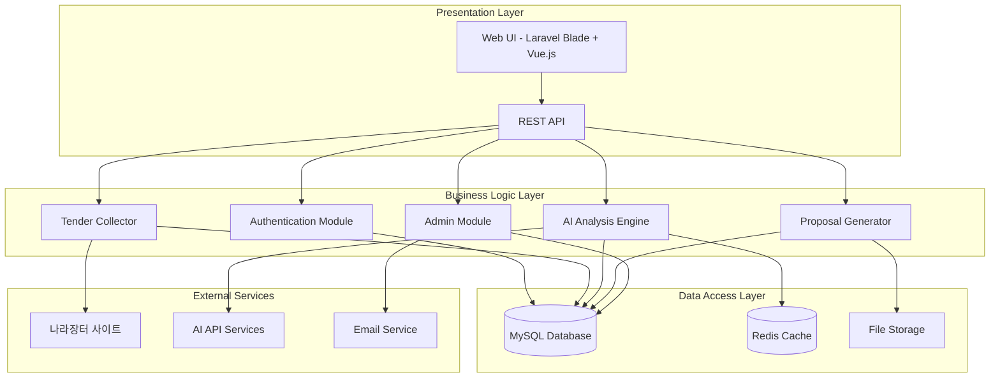
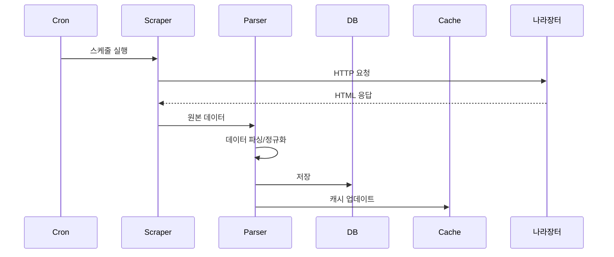
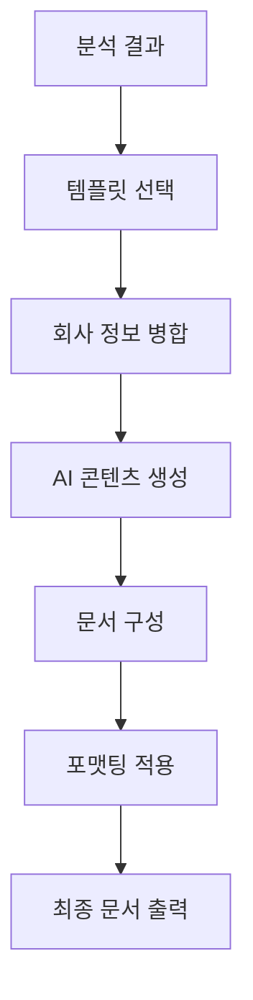
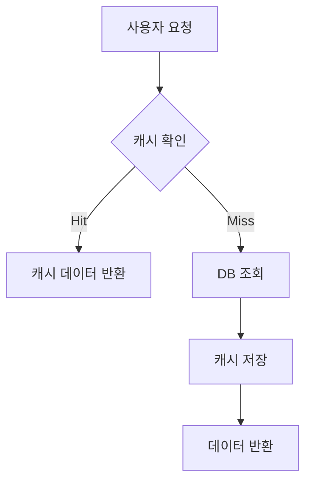

# 시스템 아키텍처 설계서

## 1. 전체 시스템 아키텍처

### 1.1 시스템 개요
나라장터 AI 제안서 자동생성 시스템은 **3계층 웹 애플리케이션 아키텍처**를 기반으로 설계됩니다.



### 1.2 아키텍처 특징
- **모듈화**: 각 기능별 독립적 모듈로 구성하여 확장성 및 유지보수성 확보
- **확장성**: 수평적 확장이 용이한 구조 설계
- **보안성**: 계층별 보안 구현 및 데이터 암호화
- **성능**: 캐싱 및 비동기 처리를 통한 성능 최적화

## 2. 핵심 모듈 설계

### 2.1 인증/권한 모듈 (Authentication Module)
**책임**: 사용자 인증 및 권한 관리

**구성 요소**:
- `AuthController`: 로그인/로그아웃 처리
- `UserController`: 사용자 관리
- `RolePermissionManager`: 권한 관리
- `AuthMiddleware`: 인증 미들웨어

**기술 스택**:
- Laravel Sanctum (API 토큰 인증)
- Spatie/laravel-permission (권한 관리)
- bcrypt (패스워드 해싱)

```php
// 권한 구조 예시
class Role {
    const SUPER_ADMIN = 'super_admin';
    const ADMIN = 'admin'; 
    const USER = 'user';
}

class Permission {
    const MANAGE_USERS = 'manage_users';
    const VIEW_ANALYTICS = 'view_analytics';
    const GENERATE_PROPOSALS = 'generate_proposals';
}
```

### 2.2 나라장터 수집 모듈 (Tender Collector)
**책임**: 나라장터 데이터 자동 수집 및 파싱

**구성 요소**:
- `TenderScraper`: 웹 스크래핑 엔진
- `DataParser`: 데이터 파싱 및 정규화
- `TenderRepository`: 데이터 저장 관리
- `BatchProcessor`: 배치 처리 관리

**수집 플로우**:


**기술 스택**:
- Goutte (웹 스크래핑)
- Laravel Queue (배치 처리)
- Redis (캐싱)

### 2.3 AI 분석 엔진 (AI Analysis Engine)
**책임**: 용역공고 분석 및 적합성 평가

**구성 요소**:
- `AnalysisController`: 분석 요청 처리
- `AIService`: AI API 연동
- `MatchingAlgorithm`: 매칭 알고리즘
- `ReportGenerator`: 분석 보고서 생성

**분석 프로세스**:


**AI 분석 항목**:
- 기술적 적합성 (40%)
- 경험 및 실적 (30%)
- 예산 및 일정 (20%)
- 기타 요구사항 (10%)

### 2.4 제안서 생성 모듈 (Proposal Generator)
**책임**: AI 기반 자동 제안서 생성

**구성 요소**:
- `TemplateManager`: 템플릿 관리
- `ContentGenerator`: AI 콘텐츠 생성
- `DocumentProcessor`: 문서 조합 및 포맷팅
- `ExportService`: 파일 출력 (PDF/Word)

**생성 플로우**:


## 3. 데이터베이스 아키텍처

### 3.1 데이터베이스 설계 원칙
- **정규화**: 3NF 까지 정규화 적용
- **인덱싱**: 쿼리 성능 최적화를 위한 적절한 인덱스 설계
- **파티셔닝**: 대용량 데이터 테이블 분할 고려
- **백업**: 일일 자동 백업 및 복원 전략

### 3.2 핵심 테이블 구조

**사용자 관리 테이블**:
```sql
users (id, name, email, password, created_at, updated_at)
roles (id, name, guard_name, created_at, updated_at)
permissions (id, name, guard_name, created_at, updated_at)
model_has_roles (role_id, model_type, model_id)
```

**용역공고 테이블**:
```sql
tenders (id, title, content, agency, budget, deadline, category_id, status, created_at, updated_at)
tender_categories (id, name, parent_id, created_at, updated_at)
tender_attachments (id, tender_id, filename, filepath, filesize, created_at, updated_at)
```

**AI 분석 테이블**:
```sql
analyses (id, tender_id, user_id, score, technical_score, experience_score, budget_score, status, created_at, updated_at)
analysis_details (id, analysis_id, category, content, score, created_at, updated_at)
company_profiles (id, name, description, capabilities, experiences, created_at, updated_at)
```

## 4. 보안 아키텍처

### 4.1 보안 요구사항
- **인증**: 강력한 패스워드 정책 및 다단계 인증
- **권한**: 역할 기반 접근 제어 (RBAC)
- **암호화**: 민감 데이터 암호화 저장
- **통신**: HTTPS 필수 적용
- **감사**: 모든 중요 작업 로깅

### 4.2 보안 구현 방안


**보안 계층**:
1. **네트워크 보안**: Firewall, WAF 적용
2. **애플리케이션 보안**: Input validation, XSS/CSRF 방어
3. **데이터 보안**: 데이터 암호화, 접근 제어
4. **모니터링**: 침입 탐지, 로그 분석

## 5. 성능 아키텍처

### 5.1 성능 최적화 전략
- **캐싱**: Redis를 활용한 다단계 캐싱
- **CDN**: 정적 자원 CDN 배포
- **데이터베이스**: 쿼리 최적화 및 인덱싱
- **비동기**: 큐를 활용한 비동기 처리
- **로드밸런싱**: 트래픽 분산 처리

### 5.2 캐싱 전략


**캐시 레벨**:
- **L1 캐시**: 애플리케이션 메모리 캐시
- **L2 캐시**: Redis 분산 캐시
- **L3 캐시**: HTTP 캐시 헤더

## 6. 배포 아키텍처

### 6.1 배포 환경
- **개발**: Local Development Environment
- **테스트**: Staging Environment  
- **운영**: Production Environment

### 6.2 CI/CD 파이프라인


**배포 도구**:
- Git (버전 관리)
- Laravel Envoy (배포 스크립트)
- Docker (컨테이너화, 선택사항)
- Nginx (웹 서버)

## 7. 모니터링 및 로깅

### 7.1 모니터링 지표
- **시스템 지표**: CPU, Memory, Disk, Network
- **애플리케이션 지표**: Response time, Throughput, Error rate
- **비즈니스 지표**: User activity, Feature usage, Conversion rate

### 7.2 로깅 전략


**로그 레벨**:
- ERROR: 시스템 오류
- WARNING: 주의 필요 상황
- INFO: 일반 정보
- DEBUG: 디버깅 정보

---

**작성일**: 2024-08-28  
**작성자**: AI 시스템 분석  
**검토자**: [검토 필요]  
**승인자**: [승인 필요]  
**버전**: 1.0